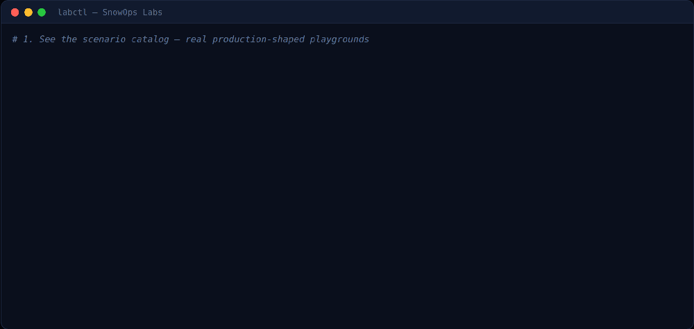
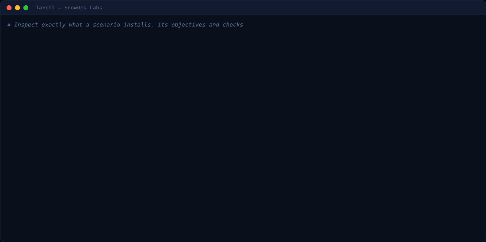
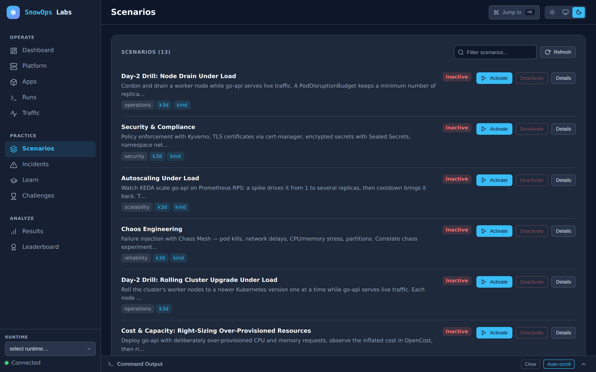
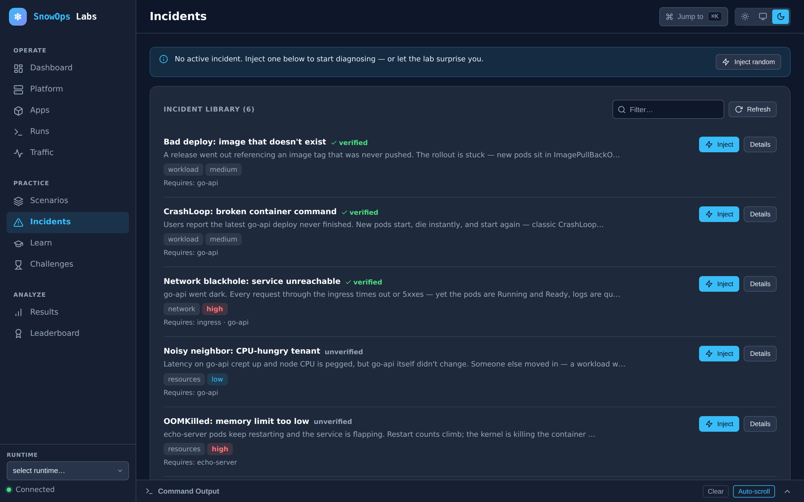
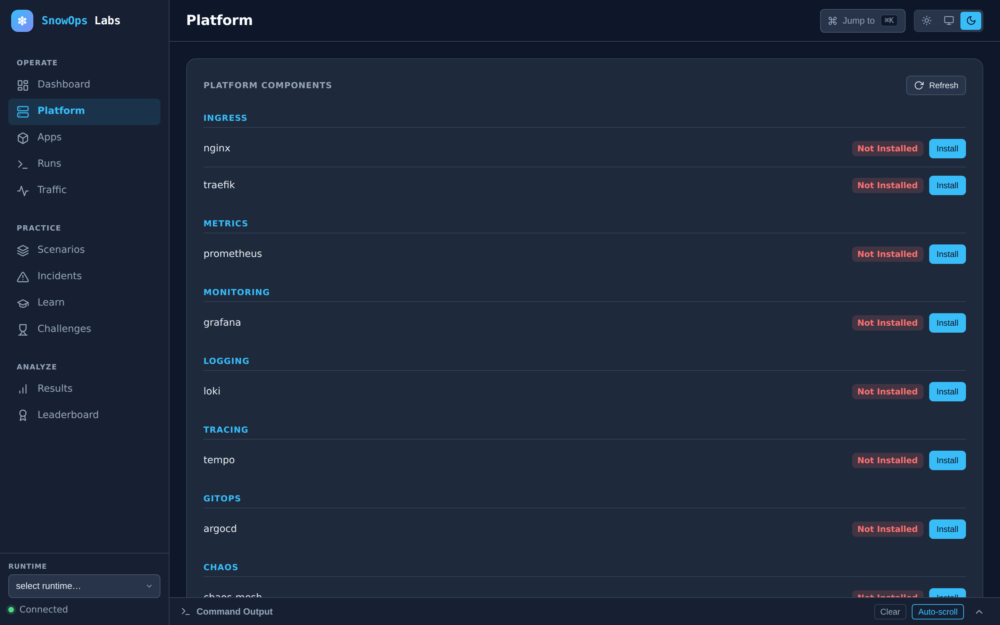
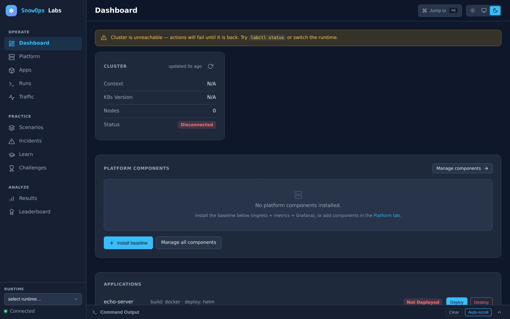

<p align="center">
  <picture>
    <source media="(prefers-color-scheme: dark)"  srcset="docs/assets/brand/logo-dark.png">
    <source media="(prefers-color-scheme: light)" srcset="docs/assets/brand/logo-light.png">
    
  </picture>
</p>

<p align="center">
  <em>Stand up a production-shaped Kubernetes cluster · break it on purpose · fix it · get graded.</em>
</p>

<p align="center">
  <a href="LICENSE"></a>
  <a href="https://github.com/sagar2395/snowopslabs/actions/workflows/ci.yaml"></a>
  <a href="https://github.com/sagar2395/snowopslabs/releases"></a>
  
  
  <a href="CONTRIBUTING.md"></a>
</p>

**SnowOps Labs is a Kubernetes platform-engineering simulator.** It stands up a
realistic, production-shaped cluster on your laptop in minutes, breaks it in
realistic ways, and grades you on how you fix it.

Practise the things production never lets you practise: diagnosing a
CrashLoopBackOff with a pager going off, draining a node under load without
breaking the SLO, deciding between two service meshes with evidence instead of
opinion.

> **Early release.** The core loop — stand up a cluster, run a scenario, break
> it, fix it, tear it down — works today; expect rapid iteration and the odd
> rough edge, and please [file issues](https://github.com/sagar2395/snowopslabs/issues).
> See [`docs/PRODUCT.md`](docs/PRODUCT.md) for what it is and who it is for, and
> [`docs/architecture/ARCHITECTURE.md`](docs/architecture/ARCHITECTURE.md) for
> how it works.
>
> Runs on **macOS (Apple Silicon and Intel), Linux, and Windows via WSL2** —
> see [Running on WSL](#running-on-wsl). Local clusters (`k3d`/`kind`); a
> `SnowOps Labs` project.

<p align="center">
  
</p>

## The four loops

| Loop | What you do | Command |
|---|---|---|
| **Build** | Stand up a cluster and install a real platform stack from swappable providers | `labctl init` |
| **Simulate** | Activate a declarative scenario with objectives and verifiable checks | `labctl scenario up <name>` |
| **Break** | Inject a realistic, reversible fault while traffic flows and alerts fire | `labctl incident inject <name>` |
| **Measure** | Grade the outcome — checks passed, time taken, hints used | `labctl scenario verify <name>` |

Everything you install is the real thing: actual Prometheus, actual Istio,
actual Kafka. Failures are injected into real systems, so the signal you debug
is the signal you would see in production.

## What's inside

| Layer | What it does |
|---|---|
| **Runtimes** | `k3d` (the golden path), `kind` (headless, powers CI), `incluster` (shared team server) |
| **Platform** | Ingress (Traefik/Nginx), monitoring (Prometheus + Grafana), logging (Loki), tracing (Tempo), GitOps (ArgoCD), mesh (Istio/Linkerd), data (Kafka/Postgres), secrets (Vault/ESO), autoscaling (KEDA), cost (OpenCost), security (Kyverno, cert-manager), chaos (Chaos Mesh) |
| **Scenarios** | Declarative playgrounds with objectives and machine-verifiable checks |
| **Incidents** | Reversible production faults with progressive hints and MTTR measurement |
| **Learn** | Ordered paths chaining scenarios and incidents into a curriculum |
| **Challenges** | Timed, graded runs with hidden hints |
| **Apps** | `go-api` (HTTP + metrics + tracing), `echo-server` (HTTP + Redis) |
| **CLI + UI** | `labctl` — one binary with the web dashboard embedded |

## See it in action

Every asset below is real `labctl` output and the actual embedded UI — no mockups.

**Inspect a scenario before you run it.** `labctl scenario info` shows exactly
what a scenario installs — its stages, objectives, the machine-checked
verifications that grade you, and copy-paste explore hints:

<p align="center">
  
</p>

**Drive it from a browser.** `labctl ui` serves an embedded web dashboard at
`http://localhost:3939` — no extra install — and it follows your system
light/dark theme:

<picture>
  <source media="(prefers-color-scheme: dark)"  srcset="docs/assets/ui-scenarios.png">
  <source media="(prefers-color-scheme: light)" srcset="docs/assets/ui-scenarios-light.png">
  
</picture>

More of the dashboard — click any thumbnail for full size:

| Fault library | Platform components | Operate hub |
|---|---|---|
| [](docs/assets/ui-incidents.png) | [](docs/assets/ui-platform.png) | [](docs/assets/ui-dashboard.png) |

## Prerequisites

You need two things before anything else: **Docker with enough memory**, and the
**cluster tools** (`kubectl`, `helm` 3, `k3d`). `labctl` installs the cluster
tools for you — pin versions live in [`config/versions.env`](config/versions.env)
— so the only manual step is giving Docker enough resources.

**Docker needs at least 4 CPUs and 8 GB of memory.** `labctl init` runs a 3-node
k3d cluster plus the full platform stack (Prometheus, Grafana, Alertmanager,
Loki, …). The 2 GB a fresh Docker VM ships with is not enough; it shows up as
API-server "TLS handshake timeout" errors partway through the install. Set the
resources the way your platform expects:

### macOS

- **Docker Desktop:** Settings → Resources → raise Memory to **8 GB** (and CPUs
  to 4), then Apply & Restart.
- **Colima** (lightweight CLI alternative): `colima start --cpu 4 --memory 8`

### Linux

- Docker runs natively, so it already uses your machine's CPU and RAM — no VM to
  resize. Just make sure the host has ≥4 CPUs and ≥8 GB free.
- Install Docker Engine and add yourself to the `docker` group
  (`sudo usermod -aG docker $USER`, then log out and back in) so `labctl` can
  talk to the daemon without `sudo`.

### Windows (WSL2)

- Run **everything inside WSL2** (Ubuntu recommended) — never native Windows
  PowerShell. Treat the WSL shell as a normal Linux box for every command below.
- Either enable **Docker Desktop → Settings → Resources → WSL Integration** for
  your distro, or run a native Docker daemon inside WSL. The same ≥4 CPU / 8 GB
  applies — set it in `.wslconfig` on the Windows side if you use a native
  daemon. Full details in [Running on WSL](#running-on-wsl).

> **Building from source?** Contributors additionally need **Go 1.24+** and
> **Node 22+**. End users following the Quickstart below do **not** — the
> released `labctl` binary already has the UI embedded.

## Quickstart

The whole lab is driven by one command: **`labctl`**. Getting started is two
steps — **(1) get the `labctl` binary** and **(2) check out the repo** — then you
run the loop. `make` is **optional**; every step below uses `labctl` directly.

> **Why you still need the repo.** `labctl` runs the scripts under
> `scenarios/ platform/ runtimes/ bootstrap/` and `src/engine/` at runtime, so
> the release archive (which ships only the binary) is not standalone. You get
> the binary from a release **and** clone the repo — the binary just saves you
> from installing Go/Node and building it yourself.

### 1. Install `labctl`

**Recommended: download a release (no Go/Node, no building).** This is the easy
path for everyone who isn't changing `labctl` itself. Grab the archive for your
platform from the [Releases page][releases], verify the checksum, and move the
binary onto your `PATH`.

Pick the block for your platform (the one-liner auto-detects your OS/arch):

**macOS or Linux**

```bash
# Set the version you want from the Releases page, then run the block as-is.
VERSION=1.0.0
OS=$(uname -s | tr '[:upper:]' '[:lower:]')          # darwin | linux
ARCH=$(uname -m | sed 's/x86_64/amd64/;s/aarch64/arm64/')  # amd64 | arm64
BASE="https://github.com/sagar2395/snowopslabs/releases/download/v${VERSION}"

curl -fsSL "${BASE}/labctl_${VERSION}_${OS}_${ARCH}.tar.gz" -o labctl.tar.gz
curl -fsSL "${BASE}/checksums.txt" -o checksums.txt
# verify: sha256sum on Linux, shasum -a 256 on macOS
(command -v sha256sum >/dev/null && sha256sum -c checksums.txt --ignore-missing) \
  || shasum -a 256 -c checksums.txt --ignore-missing
tar xzf labctl.tar.gz labctl
sudo mv labctl /usr/local/bin/       # now `labctl` runs from anywhere
labctl --version
```

**Windows (inside your WSL2 shell)** — there is no separate Windows build; WSL is
Linux, so run the **macOS or Linux** block above exactly as written from inside
your distro (it resolves to the `linux` archive automatically).

**Alternative: build from source** (contributors, or anyone who wants the latest
`main`). Needs **Go 1.24+** and **Node 22+**:

```bash
make cli-build          # builds bin/labctl (UI embedded); run it as ./bin/labctl
make cli-install        # …or install onto PATH: copies to $(go env GOPATH)/bin/labctl
```

> The Go source lives under `src/` (the root `make` targets delegate there), so
> `make cli-build` leaves the binary at `./bin/labctl`. Use `make cli-install`
> (ensure `$(go env GOPATH)/bin` is on your `PATH`) to get a plain `labctl`.

### 2. Check out the repo and create your config

```bash
git clone https://github.com/sagar2395/snowopslabs.git && cd snowopslabs
cp config/.env.example .env
```

Run `labctl` from inside the repo (it auto-detects the project root), or from
anywhere with `--project-dir /path/to/snowopslabs`.

### 3. Run the loop — no `make` required

```bash
labctl doctor                         # check your OS has Docker + tools ready (fixes are printed inline)
labctl setup-tools                    # install kubectl/helm/k3d for your OS (or skip; init does it)
labctl init                           # setup-tools + create the cluster + install the platform
labctl hosts add                      # map *.${DOMAIN_SUFFIX:-k3d.local} -> 127.0.0.1 (needs sudo; one-time)
labctl app build go-api               # build the image and import it into the cluster
labctl app deploy go-api              # deploy it (needs the image built first)
labctl scenario list                  # then: labctl scenario info <name> for details
labctl scenario up observability-sre
labctl scenario verify observability-sre   # did you achieve the objective?
labctl validate                       # check all content is well-formed
labctl ui                             # dashboard at http://localhost:3939
labctl teardown                       # remove everything (never hangs)
```

> **Exposing the UI on a network.** `labctl ui` binds `127.0.0.1` by default and
> serves plain HTTP — fine for a local machine. To reach it from another host,
> pass `--bind 0.0.0.0`; the server then **requires authentication** (set
> `LABCTL_AUTH=true` and add a user with `labctl users add`) and refuses to start
> otherwise, so an unauthenticated cluster-control API is never exposed. For TLS,
> pass `--tls-cert` and `--tls-key`.
>
> Prefer `make`? `make init` / `make teardown` / `make reset` are equivalent to
> the `labctl init` / `labctl teardown` / `labctl reset` commands.
>
> `labctl app deploy` installs the Helm release but does **not** build the image —
> run `labctl app build <name>` first (it builds and imports into k3d), or the pod
> lands in `ImagePullBackOff`. `labctl hosts add` writes a managed block to
> `/etc/hosts` so the ingress hostnames below resolve; skip it and URL-based
> access (and the `grafana-reachable` scenario check) will fail with
> `no such host`. It is **not** needed for the labctl UI itself (a direct port).
>
> Want to scrape labctl itself? Start the server with `LABCTL_METRICS=true` to
> expose an optional Prometheus endpoint at `/metrics` (off by default). See the
> [CLI reference](docs/reference/cli/server.md#metrics).

[releases]: https://github.com/sagar2395/snowopslabs/releases

## Troubleshooting

| Symptom | Fix |
|---|---|
| Browser can't reach `*.k3d.local` URLs (`no such host`) | Ingress routes by hostname, which needs a local DNS entry. Run `labctl hosts add` once (sudo). The labctl UI at `http://localhost:3939` never needs this. No sudo? Set `DOMAIN_SUFFIX=127.0.0.1.nip.io` in `.env` (a wildcard DNS that resolves to localhost, needs internet) and re-run `labctl platform up`. |
| `required app(s) not deployed` when starting a scenario/challenge | The scenario needs an app that isn't running. Deploy it (`labctl app build <name> && labctl app deploy <name>`) or re-run with `--deploy-prereqs` to do it automatically. |
| Something is wedged and you want a clean slate | `labctl reset` (teardown + init) rebuilds the lab; `labctl scenario down <name>` / `labctl incident resolve` undo a single activation. |
| `TLS handshake timeout` / OOM-killed pods partway through init | The Docker VM is too small. Give it ≥4 CPU / 8 GB (`colima start --cpu 4 --memory 8`, or Docker Desktop → Resources), then `labctl reset`. |
| `init` seems stuck | First run pulls many images. Watch progress with `kubectl get pods -A -w`. |
| A tool is missing or too old | `labctl doctor` names each missing/outdated tool and how to fix it. |
| Teardown left something behind | `labctl teardown` is safe to re-run; for k3d/kind it deletes the whole cluster. |
| Which runtime should I use? | `k3d` (default, local), `kind` (CI parity), `incluster` (team server). See [runtime profiles](docs/runtime-profiles.md). |
| On WSL, `labctl ui` doesn't open a browser | Install `wslu` (`sudo apt install wslu`) so `wslview` can hand the URL to Windows; labctl falls back to `powershell.exe`/`cmd.exe` automatically. Or open `http://localhost:3939` in your Windows browser manually. |
| On WSL, `*.k3d.local` URLs work in WSL but not the Windows browser | The Windows browser reads the **Windows** hosts file. Add the same `127.0.0.1 <host>` lines to `C:\Windows\System32\drivers\etc\hosts` (as Administrator), or use `DOMAIN_SUFFIX=127.0.0.1.nip.io`. `labctl doctor` prints the full WSL guidance. |

## Running on WSL

SnowOps Labs runs on **WSL2** as a normal Linux environment — install the Linux
tools inside your distro and use it exactly as on Linux. Two Windows-specific
gotchas to know:

1. **Docker.** Either enable **Docker Desktop → Settings → Resources → WSL
   Integration** for your distro, or run a native Docker daemon inside WSL. The
   same ≥4 CPU / 8 GB requirement applies (set it in `.wslconfig` on the Windows
   side if you use a native daemon).
2. **Reaching services from a Windows browser.**
   - The **UI** (`labctl ui`, `http://localhost:3939`) just works — WSL2 forwards
     `localhost` to Windows. `labctl ui` opens it via `wslview` (install
     `wslu`: `sudo apt install wslu`) and falls back to `powershell.exe`/`cmd.exe`.
   - **Ingress hostnames** (`grafana.k3d.local`, …) opened in a *Windows* browser
     resolve against the **Windows** hosts file, not WSL's. Add the entries to
     `C:\Windows\System32\drivers\etc\hosts` (as Administrator), reach them from
     inside WSL with `curl` (where `labctl hosts add` applies), or set
     `DOMAIN_SUFFIX=127.0.0.1.nip.io` in `.env` to avoid hosts edits entirely.
   - If WSL rewrites `/etc/hosts` on restart, add `generateHosts=false` under
     `[network]` in `/etc/wsl.conf`.

`labctl doctor` detects WSL and prints this checklist.

## Project structure

The repository root is a content/authoring workspace: it surfaces what a *user*
of the project edits (scenarios, incidents, apps, platform). The Go/labctl
source is self-contained under `src/`, so a later "the engine gets its own repo"
split is a straight lift of that directory (issue #7).

```
# User-facing content and config at the root
scenarios/ incidents/     declarative content
learn/ challenges/
platform/<cat>/<prov>/    install.sh / uninstall.sh / status.sh / values.yaml
runtimes/<profile>/       k3d | kind | incluster
apps/<name>/              sample workloads
bootstrap/                tool installation
config/                   versions.env, .env.example (non-dotfile config)
docs/                     PRODUCT, ROADMAP, TESTING, architecture/, adr/, runbooks/
Makefile make/            thin root Makefile + orchestration/shell targets

# The labctl Go module — self-contained under src/
src/go.mod                module github.com/sagar2395/snowopslabs (imports unchanged)
src/Makefile src/make/    build + test targets (delegated to from the root)
src/cmd/labctl/           entrypoint
src/internal/cli/         cobra commands — thin adapters
src/internal/httpapi/     REST/WS — thin adapters
src/internal/run/         durable run engine (cancel, timeouts, locks, logs)
src/internal/store/       SQLite persistence
src/internal/toolchain/   kubectl/helm/k3d adapters + fakes for tests
src/pkg/                  public SDK: checks, scenario types, extension seam
src/ui/                   React SPA, embedded into the binary
src/engine/               app build/deploy/check strategy scripts
src/services/             shared services (redis, pager, traffic)
src/test/shell/           bats suites with kubectl/helm stubbed
```

`labctl` discovers content by walking up from the working directory to the
content root (it keys on `scenarios/` + `runtimes/`), so it still runs unchanged
from the repo root even though the binary is built under `src/`.


## Documentation

| Document | What it covers |
|---|---|
| [Product](docs/PRODUCT.md) | What SnowOps Labs is, who it's for, what's out of scope |
| [Roadmap](docs/ROADMAP.md) | The wave plan, exit criteria, Definition of Done |
| [Architecture](docs/architecture/ARCHITECTURE.md) | How the system fits together |
| [Decisions](docs/adr/) | Why it was built this way, with alternatives considered |
| [Testing](docs/TESTING.md) | The four mandatory test layers and CI gates |
| [Runbooks](docs/runbooks/) | Hands-on validation a human performs before a wave merges |
| [CLI Reference](docs/reference/cli/index.md) | Every `labctl` command and flag |
| [Scenario schema](docs/reference/scenario-schema.md) | The complete `scenario.yaml` reference |
| [Scenario catalog](docs/scenarios.md) | What ships in the repository |
| [Runtime profiles](docs/runtime-profiles.md) | k3d / kind / incluster and the profile contract |
| [Releasing](RELEASING.md) | How a versioned release is cut (goreleaser) |
| [Authoring](docs/authoring/) | Your first scenario, extension seams, stability policy |
| [Contributing](CONTRIBUTING.md) | Golden rules and the PR bar |
| [Agent context](docs/AGENT-CONTEXT.md) | The contract AI agents and new contributors work under |

## Testing

All four layers are mandatory for every change — see [docs/TESTING.md](docs/TESTING.md).

```bash
make test              # Go unit + shell, race detector, coverage gate
make test-ui           # vitest component tests
make test-e2e          # playwright journeys
make lint              # every static-analysis gate
```

## Configuration

Global settings live in `.env` (from [`config/.env.example`](config/.env.example)):

```bash
PROFILE=k3d                    # k3d | kind | incluster
CLUSTER_NAME=snowops
INGRESS_PROVIDER=traefik       # traefik | nginx
METRICS_PROVIDER=prometheus
```

Per-app settings live in `apps/<name>/app.env`:

```bash
BUILD_STRATEGY=docker
DEPLOY_STRATEGY=helm
HELM_VALUES=values-dev.yaml    # values-dev | values-prod-like | values-test
```

Own scenarios stay in your own repository — point `SNOWOPS_CONTENT_PATH` at
them and they appear alongside the built-in catalog. No pack format, no
registry ([ADR-0008](docs/adr/0008-content-extensibility-seam.md)).

**Bring your own app.** Drop a directory under `apps/<name>/` with an `app.env`
(as above) and, for the Helm strategy, a chart under `apps/<name>/deploy/helm/`.
It shows up in `labctl app list` and builds/deploys/destroys like the samples:

```bash
labctl app build <name> && labctl app deploy <name>
```

Reference it from a scenario's `prerequisites.apps` and `labctl scenario up`
will check it's deployed (and, with `--deploy-prereqs`, deploy it for you).

## Key URLs (k3d)

| Service | URL | Credentials |
|---|---|---|
| go-api | http://go-api.k3d.local | — |
| echo-server | http://echo-server.k3d.local | — |
| Grafana | http://grafana.k3d.local | admin / admin |
| Prometheus | http://prometheus.k3d.local | — |
| ArgoCD | http://argocd.k3d.local | admin / (see install output) |
| SnowOps Labs UI | http://localhost:3939 | — |

Domains follow `${DOMAIN_SUFFIX:-k3d.local}` — never hardcoded. Run
`labctl hosts add` once (it needs sudo) so these hostnames resolve to
`127.0.0.1`; `labctl hosts remove` cleans the managed block back out.

## License

Apache-2.0 — see [LICENSE](LICENSE), [NOTICE](NOTICE) and
[TRADEMARKS.md](TRADEMARKS.md).
